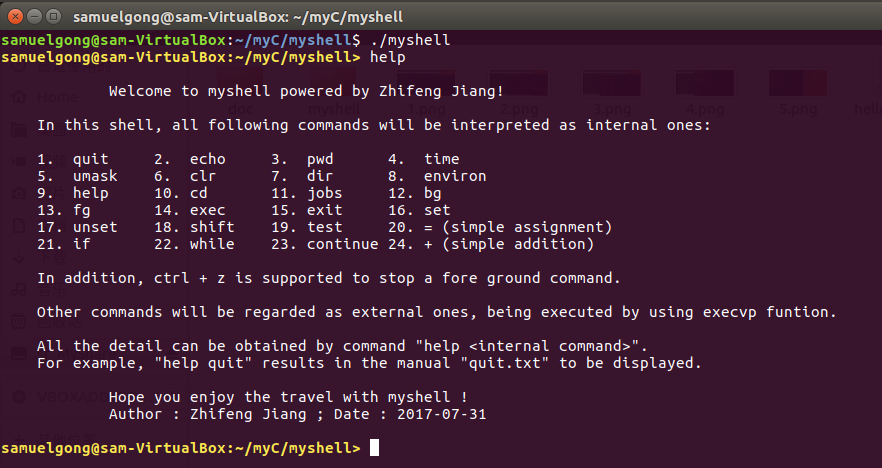
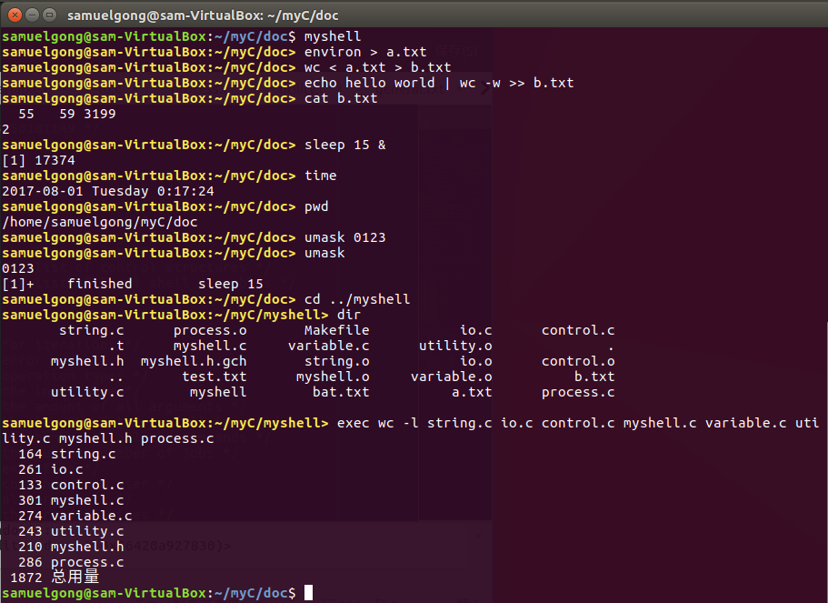
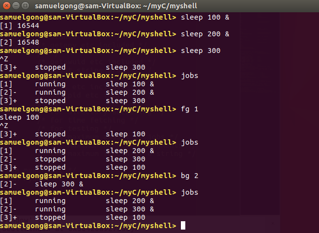
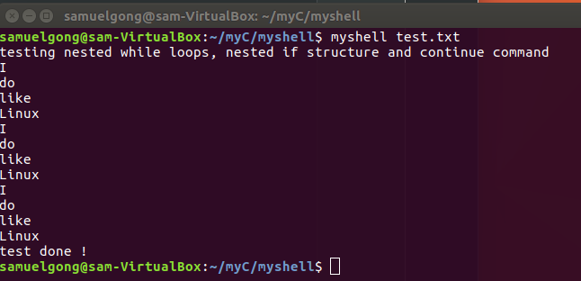

# 1. OVERVIEW
*MyShell*, as its name reveals, is a **light customized Linux shell** which resembles **bash shell** in **Ubuntu 17.04**.
As a homework assigned in the **Linux programming** course for sophomore majoring in CS,
it is an **individual project** for **non-comercial** purposes.
This program allows you to interact with the Linux system with a command line parser.  

# 2. FUNCTIONS
This shell support the following commands or operations:   

| Category | Commands |  
| :----------------: | :--------------------------------------|  
| basic iteration     | echo, time, clr, help, quit           |  
| file system         | cd, dir, pwd, umask                   |
| process management  | &, bg, fg, jobs, exec, exit, ctrl+z   |
| control structure   | continue, if, while                   |
| variable management | set, unset, shift, test, =, +         |
| io redirection      | <, >, >>, \|,                         |  
  
# 3. ARCHITECTURE  
The architecture of the project can be simply revealed from the organization of the files:  
- doc  
  + echo: the manual of command echo  
  + jobs: the manual of command jobs  
  + ...all the other command's manual  
- source  
  + makefile: convenient for make  
  + myshell.h: prototypes of all the funtions and global variables, as well as the 
declarations of all the important data structures  
  + myshell.c: main source file with main functions  
  + io.c: responsible for processing input, printing prompts, dealing with I/O 
redirection and constructing pipes  
  + process.c: interfaces for process management commands like fg, bg and so on
  + control.c: interfaces for control structure commands like if, while and so on
  + variable.c: interfaces for variable management commands like set, unset and so on
  + utility.c: interfaces for basic commands like echo, time and so on
  + string.c: tools for string procession

# 4. USAGE
## How to build the project
In CMD in Windows or Terminal in Linux, simply use the command make in the source folder 
and obtain an exacutive file named myshell.

## Some samples  
*p.s. It is impossible to show all the details in usage. Just extract some important.*
The most important one, use help command when you are in trouble with the shell:  
  
Then there is a comprehensive running result:  
  
Another comprehensive running result:  
  
Finally another running result and the underlying batch file:  
  

```
echo testing nested while loops, nested if structure and continue command  
i=0  
a=run  
while test $a != stop  
do  
	if test $i -ne 0  
	then  
		if test $a = run  
		then  
			a=stop  
		fi  
	fi  
	while test $i -le 2  
	do  
		set aha I do not like Linux  
		while test $# -ne 2  
		do  
			shift  
			if test $# -eq 4  
			then  
				continue  
			fi  
			echo $1  
		done  
		i=$i+1  
	done  
done  
echo test done !  
exit 0  
```
  
# 5. LICENCE
The content of all the codes are supposed to use a licence [AGPLv3](./LICENCE)  

# 6. HOW TO CONTRIBUTE
1. Learn what is a AGPLv3, if you have not yet done so (see details above).  
2.  Create your change to the repo in question.
- Fork the desired repo, develop and test your code changes.
- Ensure that your code is clear and comprehensible.
- Ensure that your code has an appropriate set of unit tests which all pass.
3. Submit a pull request.
4. The repo owner will review your request. If it is approved, the change will be merged. If it needs additional work, the repo owner will respond with useful comments.

# 7. CREDIT
I would like to extend my sincere gratitude to my supervisor, Jiangmin Ji, for his instructive advice and useful suggestions on my learning on Linux programming.   
